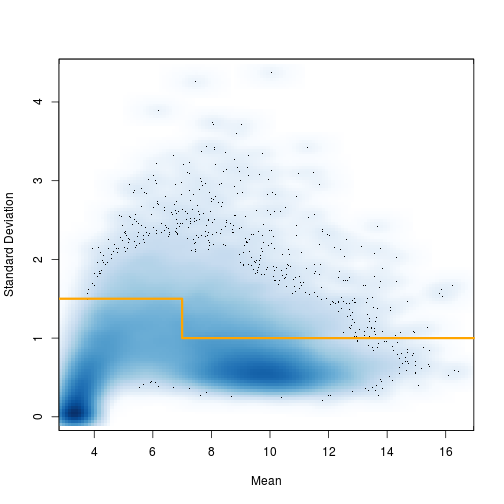
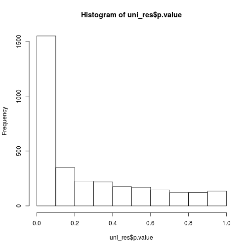
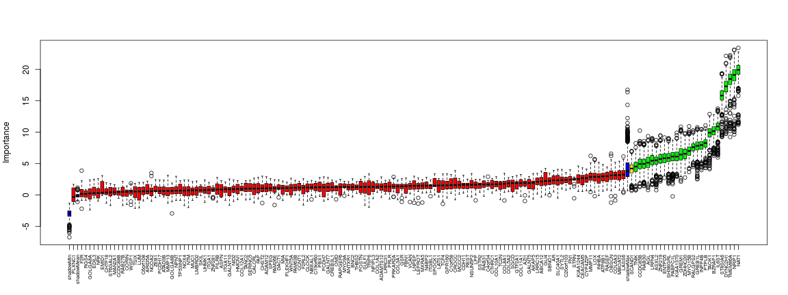

# Feature selection with TCGA BRCA Data

## Data Cleaning

### Load RNA-Seq TCGA data


```r
#library(tidyverse)
library(matrixStats)
source("code/00-paths.R")
clean <- paths$clean
load(file.path(clean, "mRNASeq/BRCA.Rda"))
load(file.path(paths$clean, "Clinical/BRCA.Rda"))
```


### Select relevant variants based on variance and mean


```r
gene_means <- rowMeans(lcounts)
gene_std <- rowSds(lcounts)

smoothScatter(gene_means, gene_std, nrpoints=500, xlab="Mean", ylab="Standard Deviation")
lines(c(-1, 7, 7, 20), c(1.5, 1.5, 1,1), col="orange", lwd=3)
```



```r
 filt_genes <- (gene_means < 7 & gene_std > 1.5) | (gene_means > 7 & gene_std > 1)
table(filt_genes)
```

```
## filt_genes
## FALSE  TRUE 
## 17318  3213
```

We will move forward with **3213** genes for feature selection.

### Determine case/control samples and clinical data


```r
ids <- tolower(substr(colnames(lcounts), 1, 12))
samps <- substr(colnames(lcounts), 14, 16)
table(samps)
```

```
## samps
##  01A  01B  06A  11A  11B 
## 1080   13    7   98   14
```

```r
as.factor(ifelse(grepl("11", samps), "N", "T")) -> samps
table(samps)
```

```
## samps
##    N    T 
##  112 1100
```

There are 7 metastatic, 1093 primary solid tumor and 112 control samples. Sanity check [here](https://gdc.cancer.gov/resources-tcga-users/tcga-code-tables/sample-type-codes) for sample codes. Also 3 samples are missing from clinical data.


```r
id_df <- data.frame(ids,
                    samps,
                    tcga_ids=colnames(lcounts))
head(id_df)

id_T <- filter(id_df, samps == "T") 

posfun <- function(x) {
    case_when(x == "positive" ~ "+",
              x == "negative" ~ "-")
}

clin %>%
    rownames_to_column(var="ids") %>%
    # separate(menopause_status, c("M", "x"), sep="[ (]") %>%
    select(ids,
           # M,
           PR=breast_carcinoma_progesterone_receptor_status,
           ER=breast_carcinoma_estrogen_receptor_status,
           HER2=lab_proc_her2_neu_immunohistochemistry_receptor_status) %>%
    mutate_at(vars(PR:HER2), posfun) %>%
    mutate(subtype = 
               case_when(PR == "+" & ER == "+" & HER2 == "+" ~ "Basal",
                         PR == "-" & ER == "-" & HER2 == "+" ~ "HER2",
                         PR == "+" & ER == "+" & HER2 == "-" ~ "LuminalA",
                         (PR == "+" | ER == "+") & HER2 == "+" ~ "LuminalB",
                         )
           ) %>%
    drop_na(subtype) %>% 
    left_join(id_T) -> brca_clin

head(brca_clin)
table(brca_clin$subtype)
nrow(brca_clin)

id_uni <- filter(id_df, !tcga_ids %in% brca_clin$tcga_ids)
head(id_uni)
nrow(id_uni)
table(id_uni$samps)
```

## Feature Selection

566 tumor and 112 normal samples will be used for univariate analyses of 3213 genes.
Rest of the dataset, 535 tumor samples, will be used for feature selection with *Boruta*, where response variable is the tumor subtype. 

Subtype definitions:

ER and PR status are assessed using the consensus of clinical tests and summarized in “breast carcinoma estrogen receptor status” and “breast carcinoma progesterone receptor status”, respectively. HER2 status is obtained from IHC in the variable labeled “lab proc her2 neu immunohistochemistry receptor status.” Samples missing data for any one of these tests are excluded from analysis, leaving a total of 638 samples with RNA-sequencing data. 

Breast cancer samples are defined as       
- “Basal” if all three markers are negative,   
- “HER2+” if only HER2 is positive,   
- “Luminal A” if either ER or PR are positive but not HER2, and   
- “Luminal B” if HER2 is positive in addition to either ER or PR.   

### Univariate Tests


```r
uni_file <- "results/brca_uni.Rda"

if (file.exists(uni_file)) {
    load(uni_file)
} else {
    rna_dat_uni <- lcounts[filt_genes, id_uni$tcga_ids]
    uni_test <- function(g) {
        glm(id_uni$samps ~ g,
            family = "binomial") %>%
            tidy() %>%
            .[2,]
        }
    rna_dat_list <- split(rna_dat_uni, rownames(rna_dat_uni))
    uni_res <- rna_dat_list  %>%
        map_df(uni_test) %>%
        mutate(genes = names(rna_dat_list))
    save(uni_res, file = uni_file)
}

head(uni_res)
```

```
##   term     estimate  std.error   statistic      p.value        genes
## 1    g -0.352301888 0.09391962 -3.75110012 0.0001760604      ?|57714
## 2    g  0.024751633 0.07679489  0.32230834 0.7472191118     ?|653553
## 3    g  0.219348754 0.09723597  2.25583958 0.0240806793       A1BG|1
## 4    g  0.007726704 0.08968543  0.08615339 0.9313444833        A2M|2
## 5    g  0.061724919 0.04263147  1.44787204 0.1476528419 A2ML1|144568
## 6    g  0.128526838 0.09284062  1.38438145 0.1662416858 A4GALT|53947
```

```r
hist(uni_res$p.value)
```



```r
uni_res %>%
    filter(p.value < 0.05/nrow(.)) %>% nrow()
```

```
## [1] 161
```

```r
uni_res %>%
    filter(p.value < 0.05/nrow(.)) %>% .$genes -> subt_genes

print(subt_genes)
```

```
##   [1] "ABCA12|26154"    "ADAM12|8038"     "ADAMTS12|81792" 
##   [4] "AGL|178"         "AKAP5|9495"      "ANTXR1|84168"   
##   [7] "AR|367"          "ARID5A|10865"    "ASPN|54829"     
##  [10] "ASXL2|55252"     "ATAD3B|83858"    "ATP8B1|5205"    
##  [13] "AZI1|22994"      "BNC2|54796"      "BZRAP1|9256"    
##  [16] "C19orf60|55049"  "C1orf58|148362"  "C20orf103|24141"
##  [19] "C4orf34|201895"  "C6orf108|10591"  "CALCRL|10203"   
##  [22] "CCDC85B|11007"   "CCDC88B|283234"  "CCNT1|904"      
##  [25] "CDH11|1009"      "CEACAM5|1048"    "CHST2|9435"     
##  [28] "CHTF18|63922"    "CLOCK|9575"      "COL10A1|1300"   
##  [31] "COL11A1|1301"    "COL12A1|1303"    "COL1A2|1278"    
##  [34] "COL3A1|1281"     "COL5A2|1290"     "COL6A3|1293"    
##  [37] "COL8A1|1295"     "CORIN|10699"     "CREB3L1|90993"  
##  [40] "CROCC|9696"      "CTHRC1|115908"   "CYP4Z2P|163720" 
##  [43] "DACT1|51339"     "DYNC2H1|79659"   "EDIL3|10085"    
##  [46] "EMID1|129080"    "ENTPD5|957"      "F2R|2149"       
##  [49] "F2RL2|2151"      "FAM26E|254228"   "FAM63B|54629"   
##  [52] "FAP|2191"        "FBN1|2200"       "FN1|2335"       
##  [55] "GALNT10|55568"   "GALNT5|11227"    "GALNT7|51809"   
##  [58] "GLI4|2738"       "GOLGA8A|23015"   "GOLGA8B|440270" 
##  [61] "GPR160|26996"    "GREB1L|80000"    "GREM1|26585"    
##  [64] "GSR|2936"        "GTF2A1|2957"     "HMCN1|83872"    
##  [67] "IL6ST|3572"      "INHBA|3624"      "INPP4B|8821"    
##  [70] "ITGA11|22801"    "ITGA1|3672"      "ITGBL1|9358"    
##  [73] "KIAA1244|57221"  "KIAA1370|56204"  "LASS6|253782"   
##  [76] "LATS1|9113"      "LEPROT|54741"    "LMBRD2|92255"   
##  [79] "LNPEP|4012"      "LOX|4015"        "LPP|4026"       
##  [82] "LRFN4|78999"     "LRRC15|131578"   "LRRC31|79782"   
##  [85] "LUM|4060"        "MAN2A1|4124"     "MBOAT2|129642"  
##  [88] "MCCC2|64087"     "MIA|8190"        "MMP11|4320"     
##  [91] "MMP13|4322"      "MUC1|4582"       "MXRA5|25878"    
##  [94] "MYO15B|80022"    "MYO9A|4649"      "N4BP2|55728"    
##  [97] "NAT1|9"          "NBEAL1|65065"    "NCOA2|10499"    
## [100] "NID2|22795"      "NOX4|50507"      "NPIPL3|23117"   
## [103] "NPNT|255743"     "NRIP1|8204"      "NRK|203447"     
## [106] "NSUN5P2|260294"  "NTM|50863"       "OBSCN|84033"    
## [109] "OMD|4958"        "PABPC1L|80336"   "PBX1|5087"      
## [112] "PCDH17|27253"    "PCDH7|5099"      "PILRB|29990"    
## [115] "PLEKHF1|79156"   "PLXNC1|10154"    "POSTN|10631"    
## [118] "PRKAR2A|5576"    "PRLR|5618"       "PTPLB|201562"   
## [121] "RAB27B|5874"     "RAB30|27314"     "RAB31|11031"    
## [124] "RALGPS2|55103"   "RAPGEF6|51735"   "RASEF|158158"   
## [127] "REST|5978"       "RGS4|5999"       "SBNO1|55206"    
## [130] "SCAND1|51282"    "SERINC5|256987"  "SGCD|6444"      
## [133] "SH3BGRL|6451"    "SKIL|6498"       "SLC40A1|30061"  
## [136] "SPEG|10290"      "SPOCK1|6695"     "SSTR2|6752"     
## [139] "ST6GAL2|84620"   "ST8SIA6|338596"  "STRN|6801"      
## [142] "SULF1|23213"     "SYTL2|54843"     "TANC2|26115"    
## [145] "TAOK1|57551"     "TC2N|123036"     "TCF4|6925"      
## [148] "THBS2|7058"      "TMEM86A|144110"  "TNIK|23043"     
## [151] "TP53INP1|94241"  "TRIP6|7205"      "TSIX|9383"      
## [154] "UHMK1|127933"    "VCAN|1462"       "WISP1|8840"     
## [157] "WNT5A|7474"      "ZDHHC20|253832"  "ZEB1|6935"      
## [160] "ZNF219|51222"    "ZNF281|23528"
```

### Boruta


```r
library(Boruta)

boruta_file <- "results/brca_boruta.Rda"
if (file.exists(boruta_file)) {
  load(boruta_file)
} else {
data.frame(t(lcounts[subt_genes,])) %>%
    rownames_to_column(var = "tcga_ids") %>% 
    inner_join(brca_clin[, c("tcga_ids", "subtype")]) %>%
    select(-tcga_ids) %>%
    mutate(subtype = as.factor(subtype))-> boruta_df
    
    Boruta(subtype ~ ., data=boruta_df,
       maxRuns = 1000,
       mtry = 50,
       ntree = 500,
       doTrace = 1
       ) -> brca_boruta
    
    save(brca_boruta,
     file=boruta_file)
}

plot(brca_boruta, xlab = "", xaxt = "n")
lz<-lapply(1:ncol(brca_boruta$ImpHistory),function(i) brca_boruta$ImpHistory[is.finite(brca_boruta$ImpHistory[,i]),i])
names(lz) <- colnames(brca_boruta$ImpHistory)
Labels <- sort(sapply(lz,median))
Labels <- str_split(names(Labels), pattern = "[.]", simplify = TRUE)[,1]
axis(side = 1,las=2,labels = Labels, 
     at = 1:ncol(brca_boruta$ImpHistory), cex.axis = 0.6)
```



Following are the selected features in `GENE_SYMBOL.ENTREZ_ID` format.


```r
cat(getSelectedAttributes(brca_boruta, withTentative = F),
    sep="\n")
```

```
## AGL.178
## ASXL2.55252
## BZRAP1.9256
## CCDC85B.11007
## DYNC2H1.79659
## ENTPD5.957
## GREB1L.80000
## GREM1.26585
## IL6ST.3572
## INPP4B.8821
## KIAA1370.56204
## LRFN4.78999
## MYO15B.80022
## NAT1.9
## NRIP1.8204
## PABPC1L.80336
## PTPLB.201562
## RAB30.27314
## RALGPS2.55103
## SH3BGRL.6451
## ST8SIA6.338596
## TAOK1.57551
## TMEM86A.144110
## TNIK.23043
## ZDHHC20.253832
## ZNF219.51222
```

Table below gives the impostance of selected features.


```r
boruta_res <- attStats(brca_boruta)
boruta_res %>%
    rownames_to_column(var = "genes") %>%
    filter(decision == "Confirmed") %>%
    arrange(-medianImp)
```

```
##             genes   meanImp medianImp     minImp    maxImp  normHits
## 1          NAT1.9 19.837470 19.931801 11.1745837 23.424309 1.0000000
## 2      NRIP1.8204 18.948005 19.118842  9.6401804 23.129353 1.0000000
## 3  TMEM86A.144110 18.327208 18.469537  9.2295622 22.253914 1.0000000
## 4   DYNC2H1.79659 17.207512 17.293708  9.7296950 22.151349 1.0000000
## 5  ST8SIA6.338596 15.764245 15.832612  9.2409729 19.358869 0.9989990
## 6      IL6ST.3572 10.832756 10.916576  5.9735303 13.749218 0.9909910
## 7     BZRAP1.9256 10.145266 10.161900  6.2498433 12.794380 0.9859860
## 8     TAOK1.57551  9.845084  9.920170  4.1138458 12.889129 0.9829830
## 9    PTPLB.201562  8.192244  8.264389  4.3006129 11.076186 0.9439439
## 10    INPP4B.8821  7.880498  7.943924  3.9505102 10.481091 0.9409409
## 11   GREB1L.80000  7.757332  7.824033  2.5121150 10.772368 0.9299299
## 12  RALGPS2.55103  7.565976  7.606049  4.4816809 10.278235 0.9309309
## 13   MYO15B.80022  6.995354  7.000331  3.6539209 10.929275 0.8938939
## 14 ZDHHC20.253832  6.533186  6.565647  2.7591237  9.843193 0.8708709
## 15    GREM1.26585  6.466222  6.429488  2.1056741 10.855934 0.8438438
## 16 KIAA1370.56204  6.121027  6.117117  2.9024985  9.893812 0.8418418
## 17  PABPC1L.80336  6.038344  6.112278 -0.2301562  8.739026 0.8288288
## 18   SH3BGRL.6451  5.915875  5.894266  1.7637448  9.033271 0.8288288
## 19     ENTPD5.957  5.838797  5.846804  2.7173911  9.145481 0.8078078
## 20   ZNF219.51222  5.755832  5.730832  2.1507568  9.459706 0.7927928
## 21    ASXL2.55252  5.422572  5.520453  0.7629248  8.731093 0.7567568
## 22    LRFN4.78999  5.523973  5.459189  1.5953325  9.025479 0.7557558
## 23        AGL.178  5.177542  5.138011  0.7797828  9.358086 0.7187187
## 24    RAB30.27314  4.955132  4.946321  1.4202992  8.563703 0.6876877
## 25  CCDC85B.11007  4.953418  4.938591  1.2744669 10.248021 0.6836837
## 26     TNIK.23043  4.484761  4.515250  0.7496864  8.240723 0.6016016
##     decision
## 1  Confirmed
## 2  Confirmed
## 3  Confirmed
## 4  Confirmed
## 5  Confirmed
## 6  Confirmed
## 7  Confirmed
## 8  Confirmed
## 9  Confirmed
## 10 Confirmed
## 11 Confirmed
## 12 Confirmed
## 13 Confirmed
## 14 Confirmed
## 15 Confirmed
## 16 Confirmed
## 17 Confirmed
## 18 Confirmed
## 19 Confirmed
## 20 Confirmed
## 21 Confirmed
## 22 Confirmed
## 23 Confirmed
## 24 Confirmed
## 25 Confirmed
## 26 Confirmed
```

